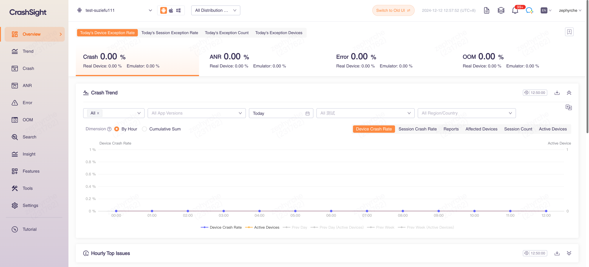

CrashSight provides exception capture, reporting and analysis services, assisting developers in pinpointing and resolving exception issues efficiently. This can effectively reduce the product crash rate and enhance user experience.

# What Can CrashSight Do?

CrashSight supports all platforms (mobile/PC/consoles/WeChat applet) and provides professional services including crash/exception detection, report, analysis, and solutions. It helps developers locate and address problem more efficiently to keep improving user experience of product.

Local(China) Website: https://crashsight.qq.com

International Website: https://crashsight.wetest.net

Create a project by clicking the "Apply for New APP" button in the "My Product" page. If you need help, for internal project, please search "CrashSight" in Tencent WeCom, and for external projects, please consult email: crashsight@tencent.com.

## Doc
Product :
https://crashsight.wetest.net/documents/en/crashsight/

OpenApi :
https://crashsight.wetest.net/openapi-docs/en/

## Scripts
[Scripts of OpenApi](https://github.com/TencentCrashSight/crashsight_openapi/tree/main/scripts)